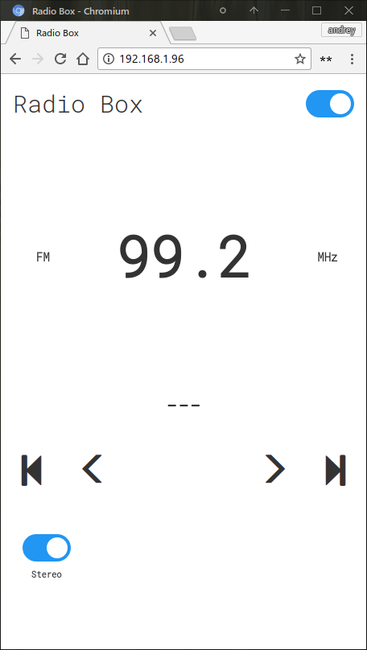

# ESP8266 Radio Box


Use TEA5767/RDA5807M FM radio module in combination with ESP8266 self hosted web interface. Project includes both hardware and software components and shared via GPLv3 permissive license.

Starting from revision D (2023) it comes as DIY Kit and grows 3 physical buttons, that allowed to run Space Invader true emulator on it.


## Key features

- WifiManager with built-in captive portal for the first time Wifi configuration
- Built-in web server for mobile app like site hosting
- Websockets server for client-server communication
- Onboard RGB LED for status indication (Rev B only)
- Onboard 240x240 px TFT screen to use offline
- Built-in CH340 Serial-bridge for one-click firmware upload
- 3 physical buttons (Rev D)
- Onboard dual AAA battery socket with voltage boost converter
- Space Invaders true emulation

## Motivation

* Want to create web-interface for FM radio module which is
    * good looking
    * mobile friendly
    * self-hosted
* Later on planned also offline use, thus TFT screen
* Had much fun assemblig it, so why not make it DIY kit

## General structure

Radio module code based on good work of [Matthias Hertel](https://github.com/mathertel/Radio). 
I added support for both RDA5807 and TEA5767 modules, however RDA5807 seems to be better choice
* it has higher output power, so you can connect headphones directly
* it has hardware volume control, RDS, bass boost, mute and few more, TEA5767 has none of those
* TEA5767 seems to has better perception than RDA5807, but with a good signal doesn't make a big difference

## Space Invaders

Emulation software ported from great [repo](https://github.com/jscrane/invaders) created by [jscrane](https://github.com/jscrane/invaders)
I added keypad support (interrup based click routines, timer based long-press detection), therefore you can control it using 3 buttons. Single click gives standard "Left", "Fire", "Right" actions. Long press corresponds to "Player 1 start", "Insert Coin" and "Pause" actions.

## How to build and flash

1. Install [Platformio[(https://platformio.org/) IDE (vscode with plugin at the moment of writing)
1. Clone project with submodules `git clone --recurse-submodules https://github.com/anabolyc/esp8266-radio-box`
1. Open either [esp8266-radio-box](/firmware/esp8266-radio-box) or [esp-space-invaders](/firmware/esp-space-invaders) project in the [vscode](https://github.com/Microsoft/vscode) and build using `Build` command. Use `RadioBox-B` or `RadioBox-D` environment depending on the board revision.
1. Use `Upload Filesystem Image` task to build and upload app files used by webserver
1. Use `Upload` or `Upload and Monitor` command to flash firmware onto device.
1. RadioBox firmware uses [WiFiManager](https://github.com/tzapu/WiFiManager) for wifi configuration. First time device will not find known WiFi nework and will start its own named ESP-XXXXXX, with ChipId suffix. Connect to that network, you will be redirected to captive portal and prompted for Wifi credentials. From this moment forward device will connect to known network automatically.
1. Now enter http://device-ip or http://ESP-XXXXXX.lan adress to control Radio via app.


## How to debug web app

To debug web-interface directly in IDE (no need to upload each change to ESP)
1. run `start debug web-server` task in vscode. It assumes you have [docker](https://www.docker.com/) installed. It will start light http server on 8080 port.
2. Find this line 
```
var NODE_IP = "192.168.0.36";
```
and change to your device IP. So app is hosted on your PC now, but will talk to actual ESP via WebSockets as a backend.
3. Acces ap at http://localhost:8080,
 
## Hardware

Design files can be found in [hardware](/hardware) section.

## Look

### Revision D


### Revision B


## Where to buy

You can support my by buying kit on [Tindie](https://www.tindie.com/products/sonocotta/esp8266-radio-box/)
